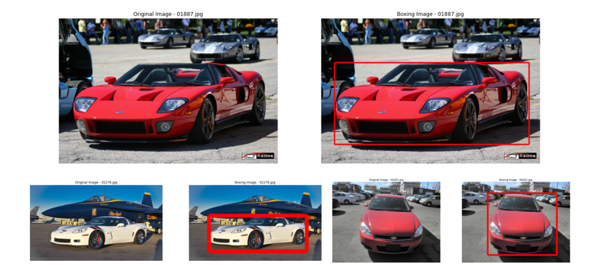
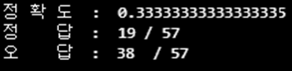

# Img-Classification

이미지 학습을 통해 196종의 차종을 구분해 보려한다.

---
## 데이터 설명 - Stanford Cars Dataset (1.85 GB)

http://ai.stanford.edu/~jkrause/cars/car_dataset.html

196 class의 (차종)

8,144 개의 train 이미지 

8,041 개의 test 이미지

총 16,185 개의 이미지로 구성

 

주어진 데이터는 바운딩 박스의 좌표 데이터도 함께 주어졌다. 따라서 전처리로 선행되어야 할 바운딩 처리는 생략하고 진행한다.

---
## 목표 

1. 이미지에서 자동차 인식

2. 구분된 자동차의 차종 분류 예측  
   (test 의 class 가 target이 된다.)

---

## 파일 실제 확인

클래스별 분포 확인

train 데이터에는 196종의 차량의 종류가 존재 

평균적으로 한 차종당 41장,   
최다 데이터를 가진 차종은 “GMC 사바나 벤” 으로 68장 이었고,  
최소 데이터는 “현대 엑쏀트“ 로 24장  

---

## 이미지 확인

임의로 10장의 이미지를 확인해 본다.

---

## 이미지 전처리 

원본 이미지에서 인식하려고 하는 차량만 선택하여 바운딩 박스처리 해준다.

학습에 사용할 차량을 Crop 하고 Resize 한다.

---

## 데이터 분할 (train data / test data) 

- 전체 16,185 개 이미지 중 Class 를 기준으로 나눔 (train 데이터는 다시 8:2로 train/val 로 나눔)
- Train (8,144) / Test (8,041)  =>  train (6,515) / val (1,629) / test (8,041)

---

## 분류 모델 선택 

4가지 분류모델을 사용하여 검증 진행

- (ResNet50, ResNet50V2, MobielNet, EfficientNet)

---

## 분류 모델 선택

검증 정확도가 가장 높은 MobielNet 을 선택 (0.8386)

- 데이터 증강과 레이어층을 변경하고 학습을 진행
- 에폭 30 이상 + 학습시간 3시간 이상이 지나면서 효율이 크게 떨어짐

---

## 모델 검증

            f_name = "03452.jpg"

03452.jpg 파일을 모델에 넣어보면, 모델이 149 class 로 추정한다.
이는 Jeep Compass SUV 2012 모델을 뜻한다.

모델의 정확도 : 82.5%
8041개의 이미지 중 6641개의 자동차를 192개의 브랜드로 정확히 분류

---

## 추가 검증

 - 직접 찍은 자동차 사진을 잘 분류 할 것인가?
 - 테이터가 전부 외국에 진출한 한국 자동차 들 (외국 사진)인데 잘 분류 할 것인가?

이 두 물음에 직접 찍은 사진과 한국의 중고차 사이트의 사진을 모델에 넣어보기로 했다.

57장의 한국 자동차 사진을 위와 동일한 전처리를 거쳐 모델에 넣어 분류해 보았다.

직접 찍은 사진의 정확도는 33%에 그쳤다. 차종과 년식, 튜닝, 조명, 각도 등 다양한 요건이 불충분 했기 때문에 정확도가 떨저지는 것 같다.

다른 차와 혼란이 거의 없는 '벨로스터' 같은 경우는 10장 중 8장을 분류 했다.

---

## 마무리

Mobilnet 은 위에 보는 11개의 차종은 100% 분류했다.

페라리나 벨로스터 등 비교적 특징들이 뚜렷하거나, 이미지들의 특성이 뚜렷하다고 느껴지는 차종들을 정확하게 분류했다고 생각되어 진다.

 
 

5개의 차종은 50% 도 분류 해 내지 못했다.

가장 낮은 분류를 보인 Chevrolet Express Van 은 Chevrolet Express Cargo Van 으로 분류하는 경우가 많았다.

Aston Martin Virage Convertible 같은 경우는  같은 Aston Martin 사의 다른 차종들로 분류 되었다.

Ferrari나 Audi도 마찬가지였다.

이들 모두 외관상 아주 비슷한 모델이나 연식에 따라 분류가 달라지는 것이었습니다.

- 사실 차량의 전폭, 헤드라이트 모양, 사이드미러의 디테일 등 웬만큼 차량에 관심이 있지 않으면 사람도 잘 구분하기 힘든 부분이다. 이런 디테일을 잡을 수 있다면 성능을 더 낼 수 있다는 아쉬움이 커지는 부분이다.

- 모델이나 파라미터, 학습시간 등을 더 조절하면 더 좋은 분류를 할 수 있지 않을까 라고 생각하는 부분이다.

